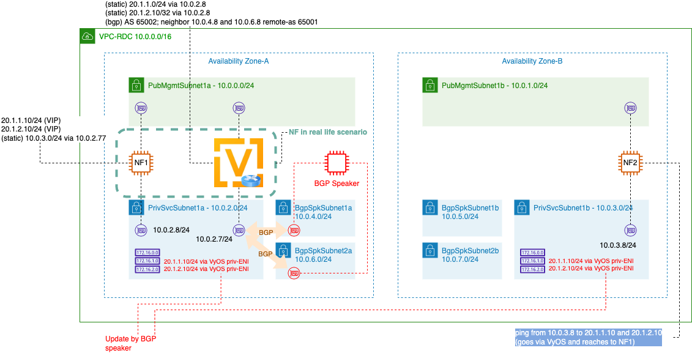

## Lab1: Single AZ VIP by BGP




1. NF1 VIP configuration 

   * Configure VIPs to NF1

   ````
   sudo ifconfig eth1:1 20.1.1.10/24
   sudo ifconfig eth1:2 20.1.2.10/24
   sudo route add -net 10.0.3.0/24 gw 10.0.2.7
   ````

2. NF2 return path setting

   ````
   sudo route add -net 20.1.0.0/16 gw 10.0.3.1
   ````

3. VyOS1 static route configuration for NF1's VIP. Since VyOS1 has default GW as eth0 (mgmt interface), we need some more static route configurations. 

   ````
   vyos@ip-10-0-0-44# configure
   set interfaces ethernet eth1 address 10.0.2.7/24
   set protocols static route 20.1.1.0/24 next-hop 10.0.2.8
   set protocols static route 20.1.2.10/32 next-hop 10.0.2.8
   set protocols static route 10.0.3.0/24 next-hop 10.0.2.1
   set protocols static route 10.0.4.0/24 next-hop 10.0.2.1
   set protocols static route 10.0.6.0/24 next-hop 10.0.2.1
   
   vyos@ip-10-0-0-44# route
   Kernel IP routing table
   Destination     Gateway         Genmask         Flags Metric Ref    Use Iface
   default         ip-10-0-0-1.ec2 0.0.0.0         UG    20     0        0 eth0
   10.0.0.0        *               255.255.255.0   U     0      0        0 eth0
   10.0.2.0        *               255.255.255.0   U     0      0        0 eth1
   20.1.1.0        ip-10-0-2-8.ec2 255.255.255.0   UG    20     0        0 eth1
   20.1.2.10       ip-10-0-2-8.ec2 255.255.255.255 UGH   20     0        0 eth1
   ````

4. VyOS1 BGP configuration

   ````
    set protocols bgp 65002 neighbor 10.0.4.8 remote-as 65001
    set protocols bgp 65002 neighbor 10.0.4.8 password bgpspeaker
    set protocols bgp 65002 neighbor 10.0.6.8 remote-as 65001
    set protocols bgp 65002 neighbor 10.0.6.8 password bgpspeaker
    set protocols bgp 65002 address-family ipv4-unicast network 20.1.1.0/24
    set protocols bgp 65002 address-family ipv4-unicast network 20.1.2.10/32
   ````

5. BGP-speaker installation
   * CFN from https://gitlab.aws.dev/proserv/bgpspeaker/-/blob/main/aws-cfn-bgps.yaml
   * Parameters
     * Stack name : *bgp-speaker*
     * VpcId: *vpc-rdc*
     * PrimarySubnet: *bgpspkSubnet1*
     * SecondarySubnet: *bgpspkSubnet2*
     * BGPSpeakerPrimaryENIIPAddress: *10.0.4.8*
     * BGPSpeakerSecondaryENIIPAddress: *10.0.6.8*
     * KeyName: your-key-name
     * VPCRTTag: *byBgpSpeaker*
     * S3Bucket: *s3://crosscom-bgp-speaker/install/*
     * BGPSpeakerAS: *65001*
     * PeerAS: *65002*
     * AuthPassword: *bgpspeaker*
     * PrimaryENIPeers: 10.0.2.7

6. Trouble shooting tips
   * Log in to BGP Speaker server and check logs directory for the log. 
   * Check commands
     * `ps -ef | grep gobgp` check whether gobgpd is running. 
     * cd bin and `./gobgp global rib`

````
   Network              Next Hop             AS_PATH      Age        Attrs
*> 20.1.1.0/24          10.0.2.77            65002        02:15:01   [{Origin: i} {Med: 0}]
*> 20.1.2.10/32         10.0.2.77            65002        02:15:01   [{Origin: i} {Med: 0}]
````

7. Make a ping from NF2 (using 10.0.3.8 source IP) to 20.1.1.10 or 20.1.2.10 (it goes via VyOS1 in AZ-1 and returns back through VyOS1).

````
[ec2-user@ip-10-0-1-74 ~]$ ping 20.1.1.10 -I eth1
PING 20.1.1.10 (20.1.1.10) from 10.0.3.8 eth1: 56(84) bytes of data.
64 bytes from 20.1.1.10: icmp_seq=1 ttl=254 time=0.853 ms
64 bytes from 20.1.1.10: icmp_seq=2 ttl=254 time=0.622 ms
64 bytes from 20.1.1.10: icmp_seq=3 ttl=254 time=0.702 ms
64 bytes from 20.1.1.10: icmp_seq=4 ttl=254 time=0.666 ms
64 bytes from 20.1.1.10: icmp_seq=5 ttl=254 time=0.704 ms
64 bytes from 20.1.1.10: icmp_seq=6 ttl=254 time=0.693 ms
^C
--- 20.1.1.10 ping statistics ---
6 packets transmitted, 6 received, 0% packet loss, time 5123ms
rtt min/avg/max/mdev = 0.622/0.706/0.853/0.077 ms
````

8. Clean up - let's clean up `bgp-rdc-nodes` stack and `bgp-speaker` stack for the next Lab2. 


If you completed Lab1 then, let's go to [Lab2](https://github.com/crosscom/aws-handson-lab-bgpspk/tree/main/Lab2).
