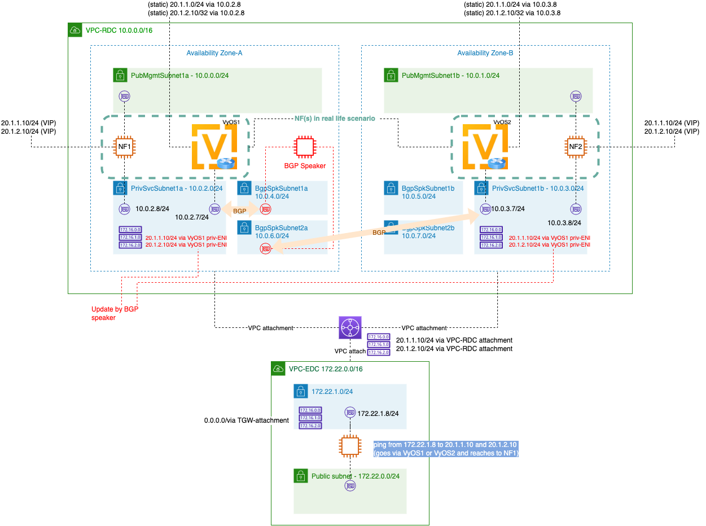

## Lab2: multi-AZ VIP




* Run CloudFormation template `bgp-rdc-nodes.yaml` to create VyOS instances and NF instances. 

* Run CloudFormation template `bgp-edc.yaml` to create client host in another VPC. 

* Create TGW in the Region (if you already have TGW in your Region, you can use existing one). 

  * TGW attachment to VPC-RDC. Please select PrivSvcSubnet1a and PrivSvcSubnet1b of each AZ. 
  * TGW attachment to VPC-EDC. 

* Create TGW static route at route table associated with above TGW attachment. 

  * 20.1.0.0/16 via VPC-RDC. 

* Update private service subnet route table at RDC (privSvcSubnet1a and privSvcSubnet1b) to have a route of`172.22.0.0/16 via TGW` .

* Update private servie subnet route table at EDC (privSvcSubnet1a) to have a default gateway to have a route of `20.1.0.0/16 via TGW`.

* Configure NF1 with VIPs

  ````
  sudo ifconfig eth1:1 20.1.1.10/24
  sudo ifconfig eth1:2 20.1.2.10/24
  sudo route add -net 172.22.0.0/16 gw 10.0.2.7
  ````

* Configure NF2 with VIPs

  ````
  sudo ifconfig eth1:1 20.1.1.10/24
  sudo ifconfig eth1:2 20.1.2.10/24
  sudo route add -net 172.22.0.0/16 gw 10.0.3.7
  ````

* VyOS1 configuration

  ````
  configure
  set interfaces ethernet eth1 address 10.0.2.7/24
  set protocols static route 20.1.1.0/24 next-hop 10.0.2.8
  set protocols static route 20.1.2.10/32 next-hop 10.0.2.8
  set protocols static route 172.22.0.0/16 next-hop 10.0.2.1
  set protocols static route 10.0.4.0/24 next-hop 10.0.2.1
  set protocols bgp 65002 neighbor 10.0.4.8 remote-as 65001
  set protocols bgp 65002 neighbor 10.0.4.8 password bgpspeaker
  set protocols bgp 65002 address-family ipv4-unicast network 20.1.1.0/24
  set protocols bgp 65002 address-family ipv4-unicast network 20.1.2.10/32
  commit
  ````

* VyOS2 configuration

  ````
  configure
  set interfaces ethernet eth1 address 10.0.3.7/24
  set protocols static route 20.1.1.0/24 next-hop 10.0.3.8
  set protocols static route 20.1.2.10/32 next-hop 10.0.3.8
  set protocols static route 172.22.0.0/16 next-hop 10.0.3.1
  set protocols static route 10.0.6.0/24 next-hop 10.0.3.1
  set protocols bgp 65002 neighbor 10.0.6.8 remote-as 65001
  set protocols bgp 65002 neighbor 10.0.6.8 password bgpspeaker
  set protocols bgp 65002 address-family ipv4-unicast network 20.1.1.0/24
  set protocols bgp 65002 address-family ipv4-unicast network 20.1.2.10/32
  commit
  ````

* BGP-speaker installation

  * CFN from https://gitlab.aws.dev/proserv/bgpspeaker/-/blob/main/aws-cfn-bgps.yaml
  * Parameters
    * Stack name : *bgp-speaker*
    * VpcId: *vpc-rdc*
    * PrimarySubnet: *bgpspkSubnet1*
    * SecondarySubnet: *bgpspkSubnet2*
    * BGPSpeakerPrimaryENIIPAddress: *10.0.4.8*
    * BGPSpeakerSecondaryENIIPAddress: *10.0.6.8*
    * KeyName: your-key-name
    * VPCRTTag: *byBgpSpeaker*
    * S3Bucket: *s3://crosscom-bgp-speaker/install/*
    * BGPSpeakerAS: *65001*
    * PeerAS: *65002*
    * AuthPassword: *bgpspeaker*
    * PrimaryENIPeers: 10.0.2.7
    * SecondaryENIPeers: 10.0.3.7

* Check BGP Speaker gobgp status with `./bin/gobgp global rib`

  ````
  [ec2-user@ip-10-0-4-8 bin]$ ./gobgp global rib
     Network              Next Hop             AS_PATH              Age        Attrs
  *> 20.1.1.0/24          10.0.2.7             65002                00:00:26   [{Origin: i} {Med: 0}]
  *  20.1.1.0/24          10.0.3.7             65002                00:00:10   [{Origin: i} {Med: 0}]
  *> 20.1.2.10/32         10.0.2.7             65002                00:00:26   [{Origin: i} {Med: 0}]
  *  20.1.2.10/32         10.0.3.7             65002                00:00:10   [{Origin: i} {Med: 0}]
  ````

* After successful installation of BGP speaker, let's configure below route at NF3 in EDC and try ping to 20.1.1.10 and 20.1.2.10. 

  ````
  sudo route add -net 20.1.0.0/16 gw 172.22.1.1
  ````

  * After confirming ping is working (NF1 is responding back), remove BGP from VyOS1 using below (then ping has to go to NF2)

  ````
  delete protocols bgp 65002 neighbor 10.0.4.8 
  ````


````
[ec2-user@ip-10-0-4-8 ~]$ ./bin/gobgp global rib
   Network              Next Hop             AS_PATH              Age        Attrs
*> 20.1.1.0/24          10.0.2.7             65002                00:09:40   [{Origin: i} {Med: 0}]
*  20.1.1.0/24          10.0.3.7             65002                00:09:24   [{Origin: i} {Med: 0}]
*> 20.1.2.10/32         10.0.2.7             65002                00:09:40   [{Origin: i} {Med: 0}]
*  20.1.2.10/32         10.0.3.7             65002                00:09:24   [{Origin: i} {Med: 0}]

---> after VyOS1 BGP termination ----

[ec2-user@ip-10-0-4-8 ~]$ ./bin/gobgp global rib
   Network              Next Hop             AS_PATH              Age        Attrs
*> 20.1.1.0/24          10.0.3.7             65002                00:10:10   [{Origin: i} {Med: 0}]
*> 20.1.2.10/32         10.0.3.7             65002                00:10:10   [{Origin: i} {Med: 0}]
[ec2-user@ip-10-0-4-8 ~]$
````


