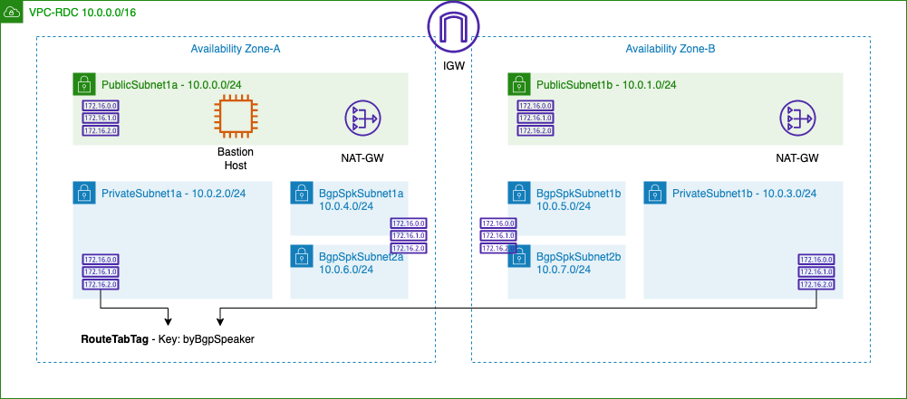
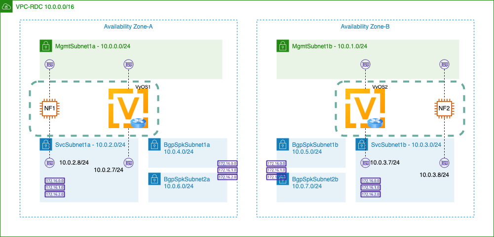

# [AWS Lab] Custom BGP Speaker Test

This document describes test environment set up and test results for Custom BGP Speaker (https://gitlab.aws.dev/proserv/bgpspeaker created by (snghmhq@)). Please note that, this site is internal training purpose only. 

## Environment Setup

* Create VPC environment using CFN `bgpspk-rdc-infra.yaml`.
  * Note that, key=`byBgpSpeaker` and value=`true` would be attached to PrivateSubnet1a and PrivateSubnet1b route table. 

* Create vRouter(s) and NF instances using `bgpspk-rdc-nodes.yaml`. 
  * VyOS vRotuers and NF instances are created with source/dest check disabled. 
  * VyOS vRouters and NF instances are with security group to allow all packets from VPC CIDR (10.0.0.0/16). 
  * CFN parameter example

----

| Key                       | Value                                                        |
| ------------------------- | ------------------------------------------------------------ |
| VpcId                     | vpc-05570a06a3ab0d48f                                        |
| MgmtSubnetAz1             | subnet-07579a92268ea1111                                     |
| SvcSubnetAz1              | subnet-0a6cf9d54da3302f3                                     |
| MgmtSubnetAz2             | subnet-06075d4a204808fb9                                     |
| SvcSubnetAz2              | subnet-09d25f6818e2fef41                                     |
| vRouterInstanceType       | c5.large                                                     |
| vRouterAmiId              | ami-0fa0d75bcdae6b2c8                                        |
| vRouterKeyPairName        | KeyForNV                                                     |
| vRouterSvcEniIpAddressAz1 | 10.0.2.7                                                     |
| vRouterSvcEniIpAddressAz2 | 10.0.3.7                                                     |
| NfInstanceType            | t3.medium                                                    |
| NfAmiId                   | /aws/service/ami-amazon-linux-latest/amzn2-ami-hvm-x86_64-gp2 |
| NfKeyPairName             | KeyForNV                                                     |
| NfSvcEniIpAddressAz1      | 10.0.2.8                                                     |
| NfSvcEniIpAddressAz2      | 10.0.3.8                                                     |

* Upload bgp-speaker main's `install` directory to your own S3. (e.g. `s3:://crosscom-bgp-speaker`)

* If environment set up is done, let's go to [Lab1](https://github.com/crosscom/aws-handson-lab-bgpspk/tree/main/Lab1).

